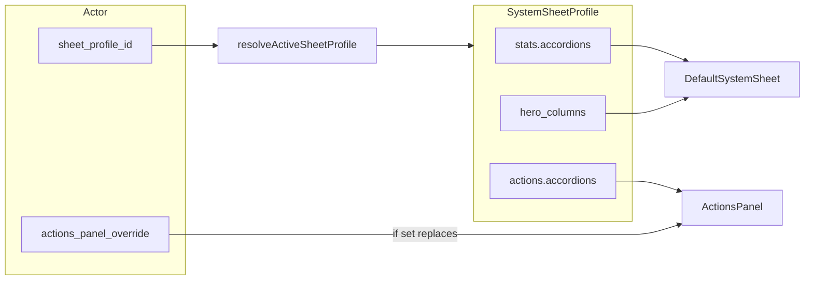

Винланд Note: None -> ---
name: Sheet profiles cleanup
overview: Перевести `sheet_profiles` на единую схему `stats` / `actions` (без раздельных «профилей сводки и действий» через `tabs`), строить UI листа из `profile.stats` / `profile.actions` с полной заменой действий при `actions_panel_override`, вынести загрузку/выбор единого профиля в `DefaultSystemSheet` для актёра и один общий селектор профиля в `SheetTab` для конфиг-редакторов.
todos:
  - id: types-parse-save
    content: Расширить SystemSheetProfile (stats/actions), миграция в parseSheetProfiles, normalizeSheetProfilesForSave и default sheet_profiles.json
    status: completed
  - id: default-system-sheet
    content: "DefaultSystemSheet: единый профиль, stats из stats.accordions, убрать leftover/tabs, селект sheet_profile_id + onPatchActor, опциональные пропы resolvedProfile"
    status: in_progress
  - id: actions-integrations
    content: "ActionsPanel + ActionsView + MiniSheetModal + ActorActionEditor: profile.actions / override, без tabs.find"
    status: pending
  - id: sheet-tab-unify
    content: "SheetTab: один селектор профиля; SheetSummary/Actions/Hero — пропсы, правка stats/actions/hero_columns"
    status: pending
  - id: template-builder
    content: SheetTemplateBuilder (и при необходимости системные JSON) согласовать с stats/actions
    status: pending
  - id: call-sites
    content: "SheetView, Compendium: убрать activeProfile; проверить линтер и сценарии GM/player"
    status: pending
isProject: false
---

# Очистка sheet_profiles и единый профиль

## Текущее состояние

- JSON и тип [`SystemSheetProfile`](src/hooks/useSystemSheetProfiles.ts): вложенные секции через **`tabs`** с `id === 'stats' | 'actions'`; парсер уже умеет мигрировать legacy `panel_action_keys` только для вкладки `actions`.
- [`DefaultSystemSheet.tsx`](src/components/Modals/DefaultSystemSheet.tsx): сводка берёт `activeProfile.tabs.find(id === 'stats')`; чипы героя — `hero_columns` на корне профиля.
- [`ActionsPanel.tsx`](src/components/Modals/ActionsPanel.tsx): уже подменяет секции на `actor.actions_panel_override.accordions` целиком, если override задан; иначе использует вкладку `actions` из профиля.
- Актёр: одно поле [`sheet_profile_id`](src/types.ts); выбор шаблона в UI сейчас в шапке [`MiniSheetModal.tsx`](src/components/Modals/MiniSheetModal.tsx) (`onPatchActor({ sheet_profile_id })`).
- Конфиг Sheet: три сабтаба в [`SheetTab.tsx`](src/components/Modals/ConfigTabs/SheetTab.tsx), у каждого [`SheetSummaryEditor`](src/components/Modals/ConfigTabs/SheetSummaryEditor.tsx) / [`SheetActionsEditor`](src/components/Modals/ConfigTabs/SheetActionsEditor.tsx) / [`SheetHeroEditor`](src/components/Modals/ConfigTabs/SheetHeroEditor.tsx) — **свой** `<select>` профиля и свой `localProfiles` (дублирование UX и риск рассинхрона при переключении сабтабов).

## Целевая модель данных

В [`useSystemSheetProfiles.ts`](src/hooks/useSystemSheetProfiles.ts) и сохранении [`sheetProfilesPersistence.ts`](src/utils/sheetProfilesPersistence.ts):

- Расширить `SystemSheetProfile` явными блоками:
  - `stats?: { accordions?: SystemSheetLayoutAccordion[] }`
  - `actions?: { accordions?: SystemSheetLayoutAccordion[] }`
  - Сохранить **`hero_columns`** на корне профиля (как сейчас), если не переносите его в `stats` — в ТЗ не трогали чипы героя.
- В **`parseSheetProfiles`**: при отсутствии `stats`/`actions` **мигрировать** из `tabs` (найти вкладки `stats` / `actions`, перенести `accordions`); после миграции не использовать `tabs` для рендера мини-листа.
- В **`normalizeSheetProfilesForSave`**: писать канонический JSON с `stats` / `actions` (и `hero_columns`, `is_default`); при необходимости для обратной совместимости можно не писать `tabs` вовсе или писать пустой/минимальный массив — по согласованию с существующим [`SheetTemplateBuilder`](src/components/Modals/ConfigTabs/SheetTemplateBuilder.tsx) (см. ниже).

## Рендеринг листа

### [`DefaultSystemSheet.tsx`](src/components/Modals/DefaultSystemSheet.tsx)

- Загрузка профиля: внутри компонента вызывать `useSystemSheetProfiles(systemName)` и `resolveActiveSheetProfile(profiles, actor.sheet_profile_id)` — **один** резолв для вариантов `gm` и `player` (убрать проп `activeProfile` и дублирующую логику у родителей).
- **Сводка (характеристики)**: строить только из `resolvedProfile.stats?.accordions`. Убрать чтение `tabs`. По «строго»: не использовать `tabs.find('stats')`; блок «остаток колонок не из аккордеонов» — **удалить**, чтобы разметка соответствовала только списку секций в профиле (колонки вне секций не показываются; настройка полного покрытия — в редакторе шаблона). Если `accordions` пустой или отсутствует — оставить текущий запасной вариант **одной** плоской сетки по всем колонкам (как для пустого дефолтного JSON).
- **Чипы героя (player)**: по-прежнему из `resolvedProfile.hero_columns`.
- **Один `<select>` шаблона для актёра**: перенести из шапки `MiniSheetModal` в `DefaultSystemSheet`, показывать только при наличии `onPatchActor` (и при необходимости только в GM-режиме / в блоке настроек — чтобы не плодить UI у игрока). `onChange` → строго `onPatchActor({ sheet_profile_id: value })` (как сейчас в модалке, строка id).

### Родители `DefaultSystemSheet`

- [`MiniSheetModal.tsx`](src/components/Modals/MiniSheetModal.tsx): убрать `useSystemSheetProfiles` / `resolveActiveSheetProfile` и селект из шапки; передать `onPatchActor` в `DefaultSystemSheet`; для вкладки «Действия» и [`ActorActionEditor`](src/components/Modals/ActorActionEditor.tsx) по-прежнему нужны аккордеоны профиля — либо дублировать лёгкий вызов `useSystemSheetProfiles` + resolve **только** для этих блоков (два запроса при открытии модалки), либо вынести хук `useResolvedActorSheetProfile(systemName, sheetProfileId)` в [`useSystemSheetProfiles.ts`](src/hooks/useSystemSheetProfiles.ts) и вызывать его **один раз** в `MiniSheetModal`, передавая в `ActionsPanel` / `ActorActionEditor` уже `profile.actions` и сиды (предпочтительно: один хук в модалке, в `DefaultSystemSheet` — опционально принимать `profiles`/`resolvedProfile` извне чтобы не дергать fetch дважды; если не передано — грузить внутри как в [`SheetView`](src/player/views/SheetView.tsx) / Compendium). Минимизировать дублирование сети: **рекомендуемый вариант** — `MiniSheetModal` один раз `useSystemSheetProfiles` + resolve, прокидывает `resolvedProfile` (и `loading`) в `DefaultSystemSheet` опциональными пропами; если пропы не заданы, `DefaultSystemSheet` сам грузит (Compendium / player sheet).

- [`SheetView.tsx`](src/player/views/SheetView.tsx), [`Compendium.tsx`](src/components/Compendium/Compendium.tsx): убрать передачу `activeProfile` / `sheetProfilesLoading`; при необходимости оставить только `systemName` и `actor`.

### Действия

- [`ActionsPanel.tsx`](src/components/Modals/ActionsPanel.tsx): заменить проп `actionsTab?: SystemSheetLayoutTab` на что-то вроде `actionsAccordions?: SystemSheetLayoutAccordion[] | null` (или передавать `profile.actions` целиком). Логика: при `actor.actions_panel_override` — **только** override; иначе — `profile.actions?.accordions`.
- [`ActionsView.tsx`](src/player/views/ActionsView.tsx), [`MiniSheetModal.tsx`](src/components/Modals/MiniSheetModal.tsx): передавать аккордеоны из единого `resolvedProfile.actions`, без `tabs.find('actions')`.
- [`ActorActionEditor.tsx`](src/components/Modals/ActorActionEditor.tsx): `seedOverrideFromTemplate` брать из `resolvedProfile.actions?.accordions` (переименовать проп с `profileActionsTab` на передачу массива аккордеонов или `actions`-блока).

## Редакторы шаблонов и конфиг Sheet (один селектор)

- [`SheetTab.tsx`](src/components/Modals/ConfigTabs/SheetTab.tsx): поднять состояние **`selectedProfileId`** и **`localProfiles`** (клон с сервера + общий `refetch` / сохранение по согласованию с детьми). Один общий `<select>` профиля + кнопка «создать шаблон» при необходимости — на уровне `SheetTab`.
- Рефакторинг [`SheetSummaryEditor`](src/components/Modals/ConfigTabs/SheetSummaryEditor.tsx) / [`SheetActionsEditor`](src/components/Modals/ConfigTabs/SheetActionsEditor.tsx) / [`SheetHeroEditor`](src/components/Modals/ConfigTabs/SheetHeroEditor.tsx): убрать внутренний селектор профиля и дублирующую загрузку `selectedProfileId`; принимать с пропов `selectedProfileId`, `localProfiles`, `setLocalProfiles`, флаги loading/saving, `refetchProfiles` — патчить только соответствующую часть профиля (`stats.accordions`, `actions.accordions`, `hero_columns`).
- Чтение/запись в редакторах: вместо `tabs.find('stats'|'actions')` — **`profile.stats` / `profile.actions`**; при создании нового профиля инициализировать `{ stats: { accordions: [] }, actions: { accordions: [] } }` (+ `hero_columns`).

## Прочие потребители `tabs`

- [`SheetTemplateBuilder.tsx`](src/components/Modals/ConfigTabs/SheetTemplateBuilder.tsx): либо перевести на чтение/запись `stats`/`actions` вместо произвольных `tabs`, либо временно оставить работу только с legacy-файлами и явно задокументировать в коде ограничение; предпочтительно **обновить билдер** под ту же каноническую схему, чтобы не было двух истин.
- Обновить дефолтный [`data/assets/default/config/sheet_profiles.json`](data/assets/default/config/sheet_profiles.json) и при наличии системных оверрайдов под `data/systems/*/sheet_profiles.json` — миграция вручную или одноразово через парсер при сохранении.

## Что удалить / не использовать

- Любой поиск «отдельного профиля сводки» и «отдельного профиля действий» (два id на актёре, два resolve и т.д.) — в коде такого поля нет; гарантировать, что нигде не остаётся логики вида «разные профили для stats и actions».
- Проп `activeProfile` у `DefaultSystemSheet` после перехода на внутренний/прокинутый единый профиль.
- Комментарии и типы, ссылающиеся на «вкладку actions в tabs» как на источник истины для мини-листа.

## Порядок работ (кратко)

1. Типы + `parseSheetProfiles` + `normalizeSheetProfilesForSave` + дефолтный JSON.
2. `DefaultSystemSheet` (stats из `stats.accordions`, герой, селект `sheet_profile_id`, опциональные пропы для уже загруженного профиля из модалки).
3. `ActionsPanel` + все вызовы (`MiniSheetModal`, `ActionsView`, тесты при наличии).
4. `ActorActionEditor` (сиды из `actions.accordions`).
5. `MiniSheetModal` / `SheetView` / `Compendium`.
6. `SheetTab` + три редактора + при необходимости `SheetTemplateBuilder`.
7. Прогнать ручную проверку: мини-лист stats/actions, override действий, сохранение шаблона из конфига.

Combat started.

### Round 1 ###
▶ Turn: Новый участник

### Round 2 ###

### Round 2 ###
▶ Turn: Винланд

### Round 2 ###
▶ Turn: Новый участник

### Round 3 ###

### Round 3 ###
▶ Turn: Винланд

### Round 3 ###
▶ Turn: Новый участник

### Round 4 ###

### Round 4 ###
▶ Turn: Винланд
Винланд ХП: -3.

### Round 4 ###
▶ Turn: Новый участник
Новый участник ХП: -5.
Новый участник ХП: -5.

### Round 5 ###

### Round 5 ###
▶ Turn: Винланд

### Round 5 ###
▶ Turn: Новый участник

### Round 6 ###

### Round 6 ###
▶ Turn: Винланд

### Round 6 ###
▶ Turn: Новый участник

### Round 7 ###

### Round 7 ###
▶ Turn: Винланд

### Round 7 ###
▶ Turn: Новый участник
Combat ended.
